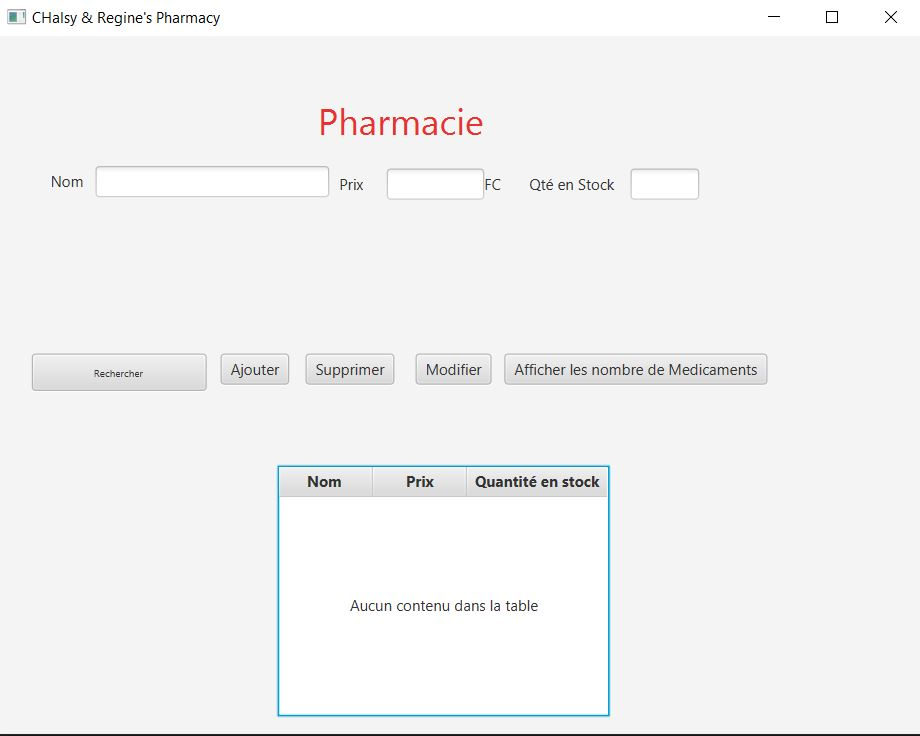

  
Cette application permet le fonctionnement d'un système de gestion de pharmacie. Elle permet au gestionnaire ou au pharmacien lui-même d'avoir un aperçu sur tous les types de médicaments qui se trouvent dans la pharmacie.

  
  
Il a aussi la possibilité d'ajouter, de supprimer et de modifier un médicament dans sa pharmacie. Cela lui permettra de bien gérer sa pharmacie en temps réel.

  
  

